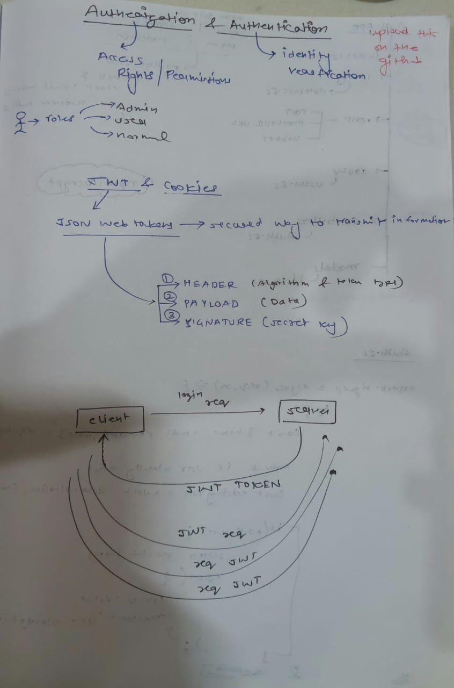
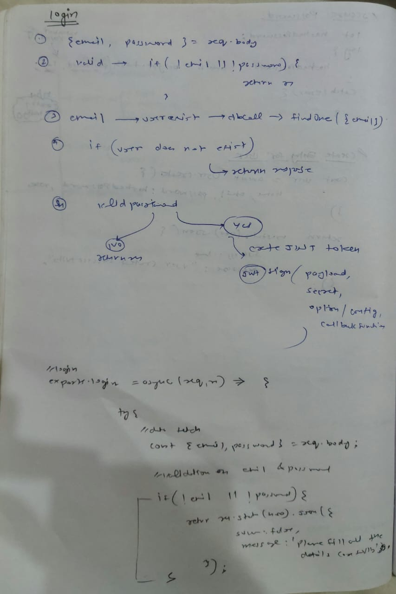
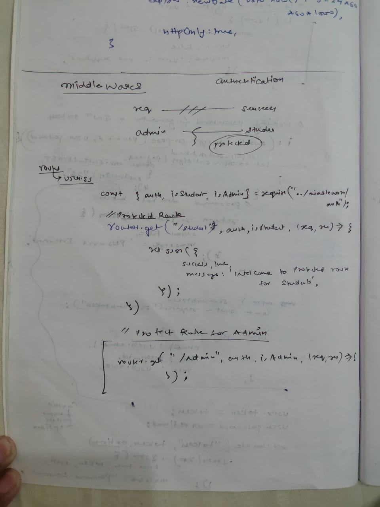

# Authentication API

This is a Node.js-based authentication API that allows users to sign up, log in, and access protected routes based on their roles (Admin, Student, Visitor). The application is deployed on Render.

## Table of Contents

- [Overview](#overview)
- [Installation](#installation)
- [Configuration](#configuration)
- [Usage](#usage)
- [API Endpoints](#api-endpoints)
- [Middleware](#middleware)
- [Models](#models)
- [License](#license)

## Overview

This project demonstrates user authentication and role-based access control using Node.js, Express, and MongoDB. It includes features for user registration, login, and protected routes that can only be accessed by authenticated users with specific roles.

## Installation

1. Clone the repository:

    ```bash
    git clone https://github.com/2115425Amar/AuthApp.git
    cd node-auth-api
    ```

2. Install the dependencies:

    ```bash
    npm install
    ```

3. Set up the environment variables. Create a `.env` file in the root directory and add the following:

    ```env
    PORT=3000
    MONGO_URI=your_mongodb_uri
    JWT_SECRET=your_jwt_secret
    ```

## Configuration

Ensure you have MongoDB installed and running on your local machine, or use a cloud-based MongoDB service like MongoDB Atlas.

## Usage

1. Start the server:

    ```bash
    npm start
    ```

2. The server will start on the port specified in the `.env` file (default is 3000).

3. Navigate to `http://localhost:3000` to see the home page.

## API Endpoints

### Public Endpoints

- **Home**
  - `GET /`: Returns a welcome message.

- **Authentication**
  - `POST /api/v1/signup`: User sign-up.
  - `POST /api/v1/login`: User login.

### Protected Endpoints

- **Test Route**
  - `GET /api/v1/test`: Accessible to authenticated users.

- **Student Route**
  - `GET /api/v1/student`: Accessible only to users with the "Student" role.

- **Admin Route**
  - `GET /api/v1/admin`: Accessible only to users with the "Admin" role.

## Middleware

- **Authentication Middleware**: Checks for the presence of a valid JWT token in cookies, request body, or headers. If the token is missing or invalid, returns a 401 Unauthorized response.

- **Role-based Middleware**:
  - **isStudent**: Ensures the user has the "Student" role.
  - **isAdmin**: Ensures the user has the "Admin" role.

## Models

### User Model

The User model is defined in `models/User.js` with the following schema:

- **name**: String (required)
- **email**: String (required)
- **password**: String (required)
- **role**: String (enum: ["Admin", "Student", "Visitor"])

## License

This project is licensed under the MIT License. See the [LICENSE](LICENSE) file for details.

---


Deployed Application: [Authentication App](https://authapp-qdzy.onrender.com/)