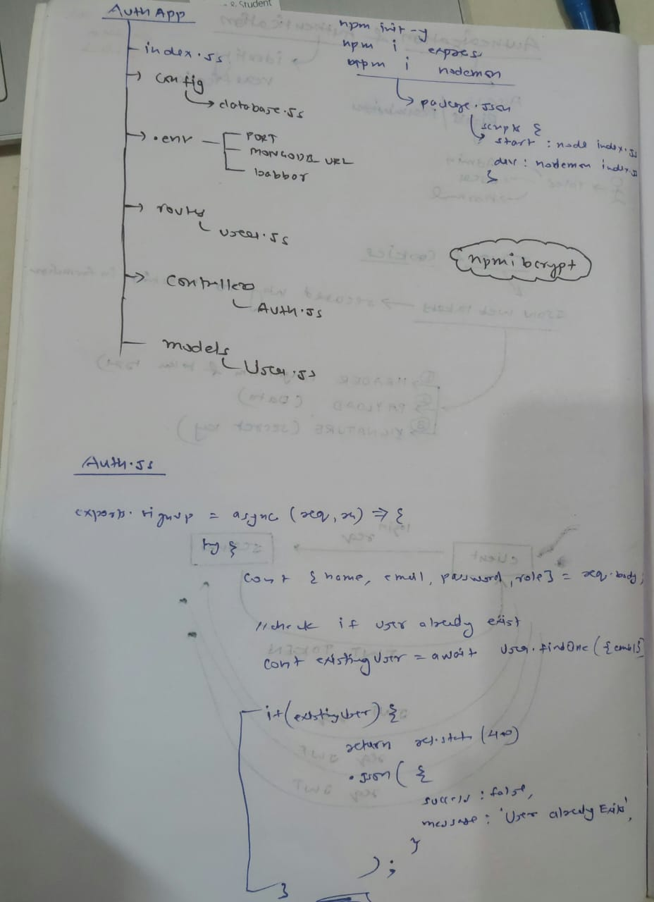

# Authentication API

This is a Node.js-based authentication API that allows users to sign up, log in, and access protected routes based on their roles (Admin, Student, Visitor). The application is deployed on Render.

## Table of Contents

- [Overview](#overview)
- [Installation](#installation)
- [Configuration](#configuration)
- [Usage](#usage)
- [API Endpoints](#api-endpoints)
- [Middleware](#middleware)
- [Models](#models)
- [License](#license)

## Overview

This project demonstrates user authentication and role-based access control using Node.js, Express, and MongoDB. It includes features for user registration, login, and protected routes that can only be accessed by authenticated users with specific roles.

## Installation

1. Clone the repository:

    ```bash
    git clone https://github.com/2115425Amar/AuthApp.git
    cd node-auth-api
    ```

2. Install the dependencies:

    ```bash
    npm install
    ```

3. Set up the environment variables. Create a `.env` file in the root directory and add the following:

    ```env
    PORT=3000
    MONGO_URI=your_mongodb_uri
    JWT_SECRET=your_jwt_secret
    ```

## Configuration

Ensure you have MongoDB installed and running on your local machine, or use a cloud-based MongoDB service like MongoDB Atlas.

## Usage

1. Start the server:

    ```bash
    npm start
    ```

2. The server will start on the port specified in the `.env` file (default is 3000).

3. Navigate to `http://localhost:3000` to see the home page.

## API Endpoints

### Public Endpoints

- **Home**
  - `GET /`: Returns a welcome message.

- **Authentication**
  - `POST /api/v1/signup`: User sign-up.
  - `POST /api/v1/login`: User login.

### Protected Endpoints

- **Test Route**
  - `GET /api/v1/test`: Accessible to authenticated users.

- **Student Route**
  - `GET /api/v1/student`: Accessible only to users with the "Student" role.

- **Admin Route**
  - `GET /api/v1/admin`: Accessible only to users with the "Admin" role.

## Middleware

- **Authentication Middleware**: Checks for the presence of a valid JWT token in cookies, request body, or headers. If the token is missing or invalid, returns a 401 Unauthorized response.

- **Role-based Middleware**:
  - **isStudent**: Ensures the user has the "Student" role.
  - **isAdmin**: Ensures the user has the "Admin" role.

## Models

### User Model

The User model is defined in `models/User.js` with the following schema:

- **name**: String (required)
- **email**: String (required)
- **password**: String (required)
- **role**: String (enum: ["Admin", "Student", "Visitor"])

## License

This project is licensed under the MIT License. See the [LICENSE](LICENSE) file for details.

---


Great question! Let's break down **how a JWT token works** in **frontend and backend communication**, step-by-step, especially from a MERN stack or typical web app/API point of view.

---

## 🔄 JWT Flow: Frontend ↔ Backend

### 1️⃣ **User Logs In (Frontend → Backend)**

* User submits login credentials (email/password) via a form.
* Frontend (React, etc.) sends a POST request:

```http
POST /api/auth/login
Content-Type: application/json

{
  "email": "amar@example.com",
  "password": "123456"
}
```

---

### 2️⃣ **Backend Verifies & Sends JWT**

* Backend (Node.js/Express) checks credentials.
* If valid, it creates a **JWT token** using a secret key:

```js
const token = jwt.sign({ userId: user._id, role: user.role }, process.env.JWT_SECRET, {
  expiresIn: '1h'
});
```

* It sends this token back to the frontend:

```json
{
  "token": "eyJhbGciOiJIUzI1NiIsInR5cCI6IkpXVCJ9..."
}
```

---

### 3️⃣ **Frontend Stores the Token**

* You store the token securely in the frontend, for example:

| Option            | Risk / Notes                                      |
| ----------------- | ------------------------------------------------- |
| `localStorage`    | Easy to use but vulnerable to XSS                 |
| `sessionStorage`  | Safer than localStorage but still XSS-prone       |
| `httpOnly Cookie` | Most secure; not accessible to JS (mitigates XSS) |

> ⚠️ Best Practice: Use **httpOnly cookie** for sensitive apps to avoid XSS risks.

---

### 4️⃣ **Frontend Makes Authenticated Requests**

* Frontend sends the JWT in the **Authorization header** with every request:

```http
GET /api/user/profile
Authorization: Bearer <your_jwt_token>
```

---

### 5️⃣ **Backend Verifies JWT on Each Request**

* Middleware on backend checks the token:

```js
const authMiddleware = (req, res, next) => {
  const authHeader = req.headers.authorization;
  if (!authHeader || !authHeader.startsWith('Bearer ')) {
    return res.status(401).json({ msg: 'No token provided' });
  }

  const token = authHeader.split(' ')[1];
  try {
    const decoded = jwt.verify(token, process.env.JWT_SECRET);
    req.user = decoded; // { userId, role }
    next();
  } catch (err) {
    res.status(401).json({ msg: 'Invalid token' });
  }
};
```

* If valid, the request proceeds to the protected route.

---

### 6️⃣ **User Logs Out (Optional)**

* Just **delete the token** from storage (`localStorage`, cookie, etc.).
* If using cookies: instruct the backend to clear the cookie.

---

## 🔐 Diagram:

```
Frontend (React)                 Backend (Express)
--------------------            ---------------------
1. Login Form  --------POST-->  /login
                               → Validate User
                               → Create JWT
2. Store JWT  <----- Response---  { token: "..." }

3. Send Token with API Requests:
   GET /profile
   Authorization: Bearer <JWT>

                             → Verify Token Middleware
                             → Attach req.user
                             → Send protected data
```

---

## ✅ Summary

| Step               | Frontend                          | Backend                          |
| ------------------ | --------------------------------- | -------------------------------- |
| Login              | Sends credentials                 | Validates, creates JWT           |
| Store Token        | Stores JWT in localStorage/cookie |                                  |
| Protected API Call | Sends token in header             | Verifies, grants access          |
| Logout             | Removes token                     | (Optional) invalidates if needed |

---


 **Session-based Authentication** vs **JWT (JSON Web Token)-based Authentication** — both are common strategies for managing **authentication and authorization**.

---

## 🔐 Session vs JWT: Key Differences

| Feature              | **Session-based Authentication**                | **JWT-based Authentication**                                  |
| -------------------- | ----------------------------------------------- | ------------------------------------------------------------- |
| **Storage Location** | Stored on the **server** (in memory or DB)      | Stored on the **client** (usually in localStorage or cookie)  |
| **Identifier**       | Stores a **session ID** in a cookie             | Stores the full **JWT token** in client (cookie/localStorage) |
| **Scalability**      | ❌ Harder to scale (needs session sharing)       | ✅ Easier to scale (stateless, no server memory needed)        |
| **Security**         | ✅ Safer (server controls sessions)              | ❌ Token exposed if stored in localStorage (XSS risk)          |
| **Token Size**       | Small (just a session ID)                       | Larger (includes user info & metadata)                        |
| **Logout**           | Easy (just delete session on server)            | Harder (need to blacklist or expire token)                    |
| **Data Tampering**   | Impossible (server stores data)                 | Possible if token is not verified                             |
| **Use Cases**        | Traditional web apps with server-rendered pages | Modern SPAs or mobile apps calling APIs                       |

---

## 📌 How They Work:

### 🗂️ **Session-based Auth (Traditional)**

1. User logs in.
2. Server creates a **session** and stores data (like `userId`) in memory/DB.
3. Server sends a **cookie with a session ID** to the client.
4. On every request, cookie is sent to server, server checks session ID.
5. User is authenticated.

> ✅ Secure
> ❌ Needs server memory or a shared session store (Redis, DB) for scaling.

---

### 🔐 **JWT-based Auth (Stateless)**

1. User logs in.
2. Server **signs a JWT** (with `userId`, role, expiry) and sends it to client.
3. Client stores token (cookie or localStorage).
4. On each request, token is sent (usually via `Authorization` header).
5. Server **verifies the token** using a secret key — no DB lookup needed.

> ✅ Scalable & stateless
> ❌ Tokens can be stolen via XSS if stored in localStorage

---

## ✅ When to Use What?

| Scenario                                   | Best Choice  |
| ------------------------------------------ | ------------ |
| Small app, secure login, server-rendered   | **Sessions** |
| Scalable APIs, mobile or SPA frontend      | **JWTs**     |
| You need server-side control over logout   | **Sessions** |
| Stateless microservices and 3rd party APIs | **JWTs**     |

---

## 🔐 Best Practice for JWT:

* Use **HttpOnly, Secure cookies** for storing tokens instead of localStorage.
* Keep **access tokens short-lived** (5–15 min).
* Use **refresh tokens** (rotated and stored securely).

---


 **cookies**, **localStorage**, and **sessionStorage** 

---

## 🍪 1. **Cookies**

### ✅ What it is:

* Small data (usually key-value pairs) stored by the browser and sent **automatically to the server** with every HTTP request.

### ✅ Size Limit:

* \~4KB

### ✅ Expiry:

* Can be set to expire at a specific date/time (persistent) or expire when the browser closes (session cookies).

### ✅ Use Case:

* Used for things like login sessions (`auth_token`), user preferences, tracking.

### ✅ Access:

* Accessible via `document.cookie` in JS.
* Sent to the server automatically in request headers.

### 🔐 Security:

* Can be marked `HttpOnly` and `Secure` for safety.

### 📦 Example:

```js
// Set a cookie
document.cookie = "username=Amar; expires=Fri, 31 Dec 2025 23:59:59 GMT; path=/";
```

---

## 🗃️ 2. **localStorage**

### ✅ What it is:

* Stores key-value pairs **in the browser only**, **never sent to the server**.

### ✅ Size Limit:

* \~5MB per domain

### ✅ Expiry:

* **Never expires** unless manually cleared by your code or the user/browser.

### ✅ Use Case:

* Save theme preferences, game state, form drafts, client-side caching.

### ✅ Access:

```js
// Set item
localStorage.setItem("theme", "dark");

// Get item
let theme = localStorage.getItem("theme");

// Remove item
localStorage.removeItem("theme");
```

---

## 🕒 3. **sessionStorage**

### ✅ What it is:

* Similar to `localStorage`, but the data lasts only for **one tab session**.

### ✅ Size Limit:

* \~5MB per domain

### ✅ Expiry:

* **Cleared when the tab or browser is closed**

### ✅ Use Case:

* Temporary form data, wizard progress, prevent duplicate form submissions.

### ✅ Access:

```js
// Set item
sessionStorage.setItem("step", "2");

// Get item
let step = sessionStorage.getItem("step");

// Remove item
sessionStorage.removeItem("step");
```

---

## 🧠 Summary Table

| Feature           | Cookies             | localStorage           | sessionStorage       |
| ----------------- | ------------------- | ---------------------- | -------------------- |
| Size Limit        | \~4KB               | \~5MB                  | \~5MB                |
| Expiry            | Manual / Auto       | Never (unless cleared) | On tab/browser close |
| Sent to Server    | ✅ Yes               | ❌ No                   | ❌ No                 |
| Accessible via JS | ✅ Yes (some limits) | ✅ Yes                  | ✅ Yes                |
| Scope             | Across tabs/windows | Across tabs/windows    | Per tab only         |

---

## 🔍 When to Use What?

* **Cookies** → when you need data to go to the server (e.g., login tokens)
* **localStorage** → when you need persistent data (e.g., dark mode, cached responses)
* **sessionStorage** → when you want short-lived, tab-specific data (e.g., form wizard state)

---

Let me know if you want to see how they behave with real examples in a browser or in a React app!


Deployed Application: [Authentication App](https://authapp-qdzy.onrender.com/)